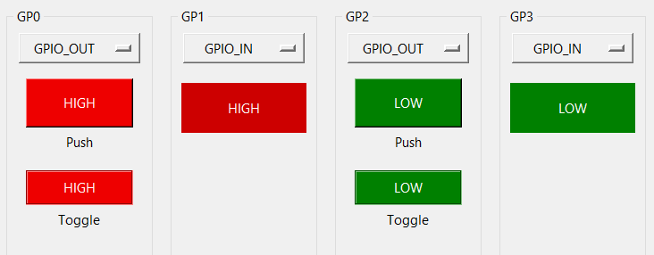

# EasyMCP2221 Workbench
Graphical User Interface for EasyMCP2221 library.

EasyMCP2221 Workbench is a GUI to play with MCP2221 and MCP2221A chips. 
It is based on [EasyMCP2221 library](https://github.com/electronicayciencia/EasyMCP2221).

See full documentation on [easymcp2221.readthedocs.io](https://easymcp2221.readthedocs.io).

## Binaries

Pre-compiled binaries exists for Windows.

## Run from source

Clone the repository and install requirements.

    pip install -r requirements.txt

### Windows

Start `EasyMCP2221-workbench.pyw` script.

From command line:

    cd workbench
    python EasyMCP2221-workbench.pyw

or, to hide console:

    pythonw EasyMCP2221-workbench.pyw

Additionaly, in some Python instalations, you can double click on `EasyMCP2221-workbench.pyw`.

### Linux

On ubuntu, Tkinter library cannot be installed by `pip`. It needs to be installed from system packages.

    sudo apt-get install python3-tk

## Screenshots

### Main window

The main window has 2 sections: the top frame and the bottom frames.

### Top frame

The top frame shows device strings. And allow to configure some chip settings. Like ADC and DAC references.

- The **quit** button terminates the application.
- **Reset** resets the device and reload stored configuration.
- **I2C Scan** performs an I2C bus scanning and display the devices found.

### GP function frame

Select the designated function for each of the four GP ports.

#### GPIO Output

The buttons are red when the output is logic 0 and green otherwise.

**Toggle** button toggle the output status.

**Push** button changes the output while it is held down.

#### GPIO input

The label is red when the output is logic 0 and green otherwise.

#### ADC and DAC

MCP2221 has three channel ADC.

When the reference is VDD, the value is shown as a percentage of the VDD. *VDD (5V)* and *VDD (3.3V)* virtual references are provided for easy reading when the device is powered with 5V or 3.3V supply.

MCP2221 has only one DAC.

#### Clock output

Frequency and duty cycle can be chosen from a set of predefined values.

#### Interrupt on change

#### I2C scan

## Compilation

To compile:

    pyinstaller EasyMCP2221-workbench.spec

Note *pyinstaller-action-windows* requires spec file with the sources.

Command line to regenerate spec file:

    pyinstaller \
      --onefile \
      -w \
      --icon=assets/icon.ico \
      --add-data="assets/icon.ico;assets" \
      --add-data="assets/icon.png;assets" \
      -n "EasyMCP2221-workbench" \
      EasyMCP2221-workbench.pyw

